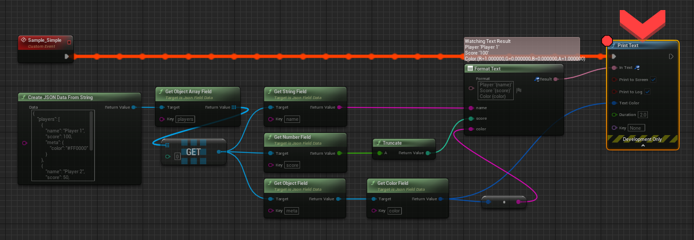
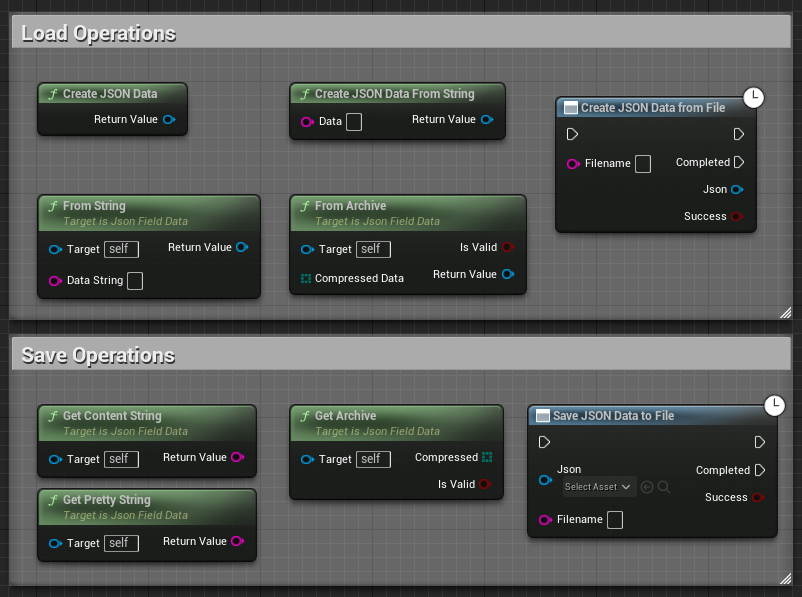

# JSONParser

Easy way to read, create and manipulate JSON in Blueprints.

# Short

* Easy to use. No C++ coding required, everything can be managed via blueprints.
* Import/Export JSON as files or with HTTP POST/GET operations.
* Include C++ Source for C++ Projects.
* Contains Unit Test and a sample project

# Details

* Supported Types: Bool, String, Name, Byte, Number(float), Vector, LinearColor, Rotator, Transform, Class and arrays of these types.
* Encode anything with AddAnyField (LinearColor, SlateFont, Custom Blueprint Struct ... also works with UObject and every other Property type...). Only encode, no decoding.
* Encode properties of your UObjects (With AddUObjectField) recursively if they are flagged with SaveGame. 
* Compress/Decompress JSON string (Archive)
* Save and Load JSON to/from File(Async).
* GET from HTTP (Async)
* POST from HTTP (Async)
* Get Texture from Data64 string.
* Get Color from hex (e.g. `#FF0000`)

# Documentation

## Installation

Copy the `Plugin` folder into your project.

## Sample

To get data from JSON

To format data as JSON

## UObject 

Most of the objects in Unreal inherit from UObject, Actors, Components etc. You can use AddUObjectField on your UObjects to format their content as JSON.
To enable some of the properties to be exported, you have to flag the relevant properties with the SaveGameFlag. 
You can locate it in the extended option of your property.

## All Nodes

### Save / Load

### HTTP

### Add and get operations (JSON base Types)

### Add and get operations (Unreal extended Types)

# Support
nicolas at chimpslab.be

# License
This is an open source project, you can use it freely. 
If you think this project is useful, please give it a star.
